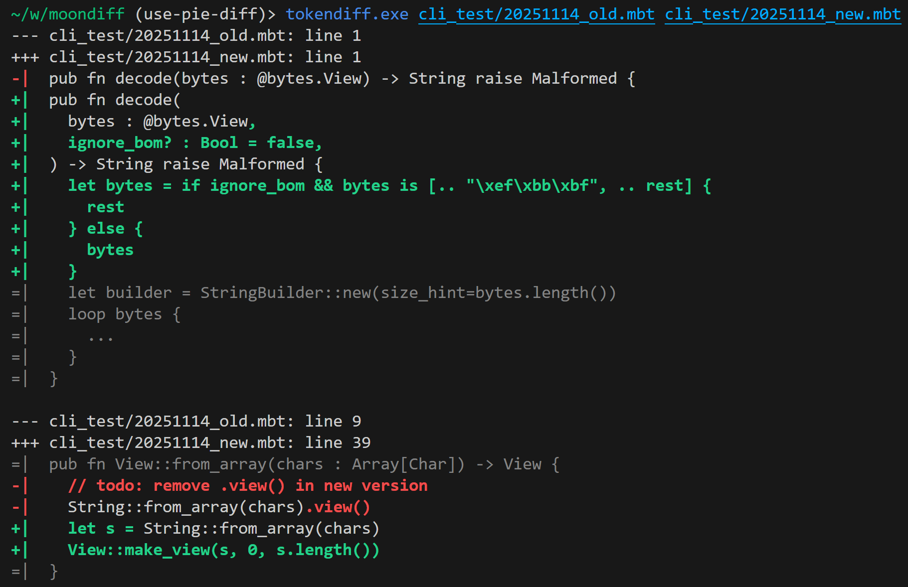

# moondiff

Difftool that aware MoonBit language syntax.



## Token based diff

### install

+ native binary

```shell
git clone https://github.com/moonbit-community/moondiff.git
cd moondiff && moon build --target native
# add `~/.local/bin` to your `PATH`
mkdir -p ~/.local/bin
cp target/native/release/build/tokendiff/cli/cli.exe ~/.local/bin/tokendiff
```
### use

moondiff relies on some features of `moonfmt`: 

+ `-block-style` (which is now the default behavior) 
+ `-add-uuid` (not the default behavior). 

If you want to use moondiff in a MoonBit repository, please first execute the following command:

```shell
moon fmt -- -add-uuid
```

**Optional**: Set up Git hooks to automatically trigger the formatter and stage the changes when committing code

```shell
#!/usr/bin/env bash

# moondiff helper script
# use your favorite editor save this script to your git pre-commit hook (default is .git/hooks/pre-commit)
# e.g: code .git/hooks/pre-commit
# then set executable permission for pre-commit hook script
# e.g: chmod +x .git/hooks/pre-commit

moon fmt -- -add-uuid

# Get the list of all modified files in the staging area for this commit, then add them all
# --cached: Only view the staging area (staged)
# --name-only: Only output the file name
# -z: Use null character as a separator to correctly handle file names containing spaces
git diff --cached --name-only -z | xargs -0 git add
```

Then, configure git to use the installed binary as an optional diff tool within that repository:

```shell
git config diff.tool tokendiff
git config difftool.tokendiff.cmd '~/.local/bin/tokendiff $LOCAL $REMOTE'
git config difftool.prompt false
```